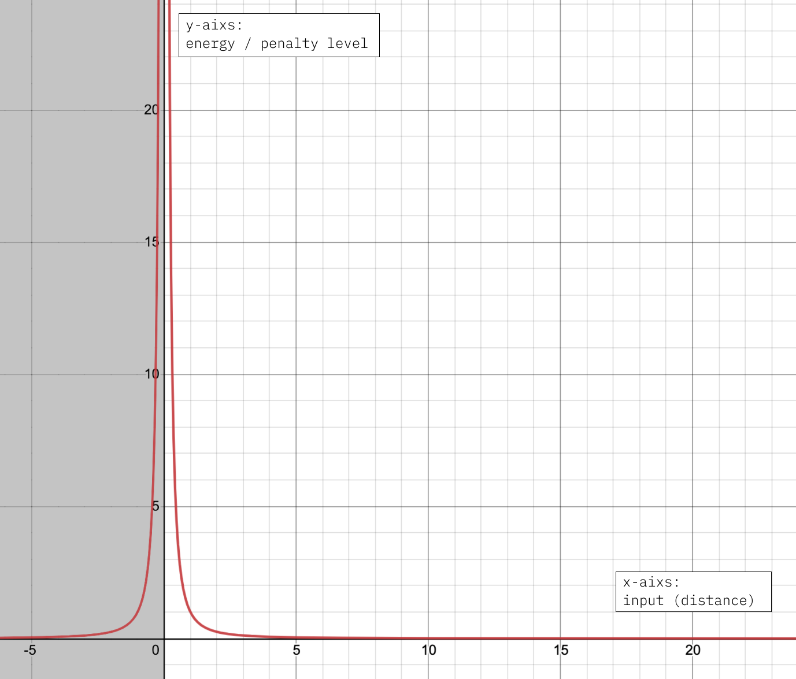
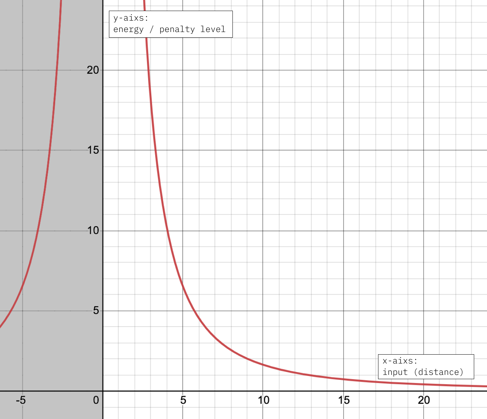

# Tutorial 4: Writing Constraints & Objectives

## Introduction

We've been using constraints and objectives in our previous tutorials, and now we will begin writing our own constraints and objectives! Being able to write your own constraints and objectives is an important step in becoming an **advanced Penrose developer**. 

You are already equipped to create beautiful diagrams with what you have already learned from the previous tutorials as an user of the Penrose system, whereas with the knowledge from this tutorial, you will be __**extending the existing Penrose system**, contributing to the platform for many other users. 

We will start with understanding what, and how are constraints and objectives done in Penrose, and then we will go through several examples line by line to apply our conceptual understanding concretely. 

## Diagramming From A Technical Perspective

Making a diagram can be encoded as an **optimization problem.** Optimization broadly is the search for the best solution to a problem subject to certain rules. For example, finding the best way to arrange your day with all the tasks that you need to finish during a certain timeframe is an optimization. There are many different optimization techniques, and Penrose utilizes numerical optimization.

Numerical optimization uses functions that are called **energy functions** to quantify how good our current solution is. An energy function outputs a numerical value \(the energy\), hence _numerical_ optimization. A key thing to remember here is **we want to minimize the energy**, the lower the better. Under the hood, all constraint functions are implemented as energy functions. Furthermore, for Penrose, a good diagram means a diagram that satisfied all the objectives and constraints written in the program. Therefore,  a diagram can be quantified with the energy of all its constraints and objective functions. 

The energy of a diagram can take on a range of values, and there are 3 specific values we care about: Global Minimum, Local Minima, and Maxima. A diagram with a global minimum energy means it is a really good diagram, and it cannot be improved by making local changes. A diagram with a local minima energy is a pretty good diagram. A diagram with a maxima energy is a bad diagram. Often in the process of diagramming, there is not just one good diagram, but many solutions — that is, there are many local minima of the energy function. Given a Style program, which defines an energy function for your family of diagrams, Penrose looks for a local minimum of the energy function by using numerical optimization.

Lastly, we write energy functions in a particular way using **autodiff helper functions**, where autodiff stands for auto differentiation**.**  This is because Penrose takes the energy function's gradient $$\nabla$$, i.e. take the derivatives of the function, to find better and better solutions.  Fore more on optimization, here's a wonderful [introduction video](https://www.youtube.com/watch?v=sDAEFFoiKZ0).  

> In short, we write energy functions with a specific set of operations in order for Penrose to optimize, finding the best diagram for us.

## Conceptual: How To Come Up With Constraints?

In the normal world, when we want a circle A contained in another circle B, this is normally what comes into our mind.


We have a mental picture of what _containment_  means to us, but there is no way for us to transfer this mental picture directly to the Penrose system and say, "Okay this is what we want when we write  `isContained(A, B)`". Therefore we need to pause for a second, and **really** think about what does it meant for a circle to be contained in another circle mathematically. 

There are generally 3 scenarios for the containment relationship between 2 circles. 


We have completely **contained**, **overlapping** but not contained, and completely **disjoint**. Disjoint means none of the points in circle A is also in circle B, i.e. they do not overlap at all.

The three scenarios are visually obvious to us. We get showed 2 circles, and in a split second, we can identify their relationship. Unfortunately, Penrose does not have eyes,  but good news is, _it speaks math!_ Therefore, let's take a new look at these circles.


Recall the general equation for a circle where $$p$$ is some point, $$c$$ is the center and $$r$$ is the radius: $$||p-c||=r$$. This equation is in vector form since Penrose supports vectors and we prefer working with vectors instead of separate  $$x, y$$.

The center coordinate and radius are the information we have about **any** circle, and we will use these information to determine two circle's containment relationship. 


Another information we will be using is the distance $$d$$ between the radii. Notice how the distance is progressively bigger as $$A$$ and $$B$$ are more disjoint. When $$A, B$$ are disjoint, we see that $$d$$'s value is the greatest. 

Let's see a scenario when a circle is perfectly contained in another one. 


Circle 1 contains circle 2 if and only if circle 1's radius is greater than the distance between their centers, plus circle 2's radius, i.e. $$r_1 > d+r_2$$. This diagram shows the most illustrative case when Circle 2 is just contained, which we can understand by intuitively reasoning about the directions of change for each degree of freedom. 

* If $$r_2$$ is any smaller, clearly Circle 2 remains contained. If $$r_2$$ is any larger, clearly Circle 2 is no longer contained. 
* If $$d$$ is any smaller, then clearly Circle 2 remains contained; if $$d$$ is any larger, then Circle 2 is no longer contained. 
* If $$r_1$$ is any larger, then clearly Circle 2 remains contained; if $$r_1$$ is any smaller, then Circle 2 is no longer contained. 
* Then by pushing variables, we can arrive at the energy expression $$d - (r1 - r2) < 0$$. 

Here's a short little proof. Read on if you are still a bit hesitant. Let $$r_{difference}=r_B-r_A$$.

* We know $$r_{difference}<0$$ when $$r_A > r_B$$, i.e. radius of the circle A \(that we want to be contained\) is greater than the radius of circle B, and in that case, A cannot be contained by B. Then we have $$d-r_{difference}>d$$.
* We have $$r_{difference} = 0$$ when $$r_A = r_B$$, i.e. the radii of the two circles are equal, and they can be contained in each other if and only if distance $$d=r_B=r_A$$ , then $$d-r_{difference}=d$$.
* We have $$r_{difference}>0$$ when $$r_A < r_B$$, i.e. $$A$$ is a smaller circle than $$B$$. In that case $$A$$ is perfectly containable, and $$d-r_{difference} < d$$.
* As shown above, we can conclude that the more contained circle $$A$$ is inside circle $$B$$, the smaller the value of $$d-r_{difference}$$.

## Concrete: How We Write Constraints

With our Penrose triple, the syntax is most likely familiar to you from your prior programming experiences, but with constraints, we will be writing code in a particular way that allows Penrose to use a particular technique called **automatic differentiation,** _**autodiff**_ ****for short. The Penrose system uses autodiff to find the optimized diagram. For more on autodiff, read [here](https://github.com/penrose/penrose/wiki/Autodiff-guide#introduction). 

There are several key rules and tricks we use when writing constraints. 

### 1. Autodiff functions

We enter this new world without our normal operations such as `+`  and `-`. Instead of what we normally can do across different languages such as javascript, python or c, we now have to use special number types and operations. 

But no worries, it's straightforward. We have unary, binary, trinary, n-ary, and composite operations. The list of autodiff functions can be found [here](https://github.com/penrose/penrose/wiki/Autodiff-guide#to-use-the-autodiff). For example, instead of `a + b`, we now do `add(a, b)`.  The composite operations are accessed through `ops.functionName`.

### 2. Special Number Types

All numbers need to actually be special types called `VarAD`  to be valid inputs for the autodiff functions. We can convert to and from normal numbers and `VarAD` using the functions `varOf: number -> VarAD` and `constOf: number -> VarAD` , and `numOf: VarAD -> number`, where the type `number` is our common const number values like `1, 2, 3, ...`.

For example, if we need to do `5 + 3` , the equivalent autodiff expression is `add(constOf(5), constOf(3))` or `add(varOf(5), varOf(5))`. 

### 3. Write functional code

We must write these functions in _straight-line functional style_ \(i.e. no imperative style, no mutating state, no for-loops or if statements\). These restrictions are so the Penrose system can work its magic. Therefore we need to avoid writing things like `x = x + 1`  which translates to `let x = add(x, constOf(1))`  in autodiff code, and instead use constant intermediate variables like this: `const x0 = ... const x1 = add(x0, constOf(1))`. 

### 4. Zero-based inequality to energy function

For every constraint function we write, we take in shapes and output a number or a tensor as penalty. In short, Penrose will try to minimize the outputs of all the constraint functions used for the diagram. 

When we write a constraint, for example, we want to constrain one circle `s1` to be smaller than another circle `s2` by some amount `offset`. In math, we would require that `r1 - r2 > offset`. An inequality constraint needs to be written in the form `p(x) > 0`.  

Since we penalize the amount the constraint is greater than `0`. So, this constraint is written as `r1 - r2 - offset > 0`, or `p(r1, r2) = r1 - r2 - offset`. 

#### Some general rules on writing energy function: 

* Let's say I want the constraint `f(x) <= c` to be true.
* I translate it to the zero-based inequality `f(x) - c <= 0`.
* I translate the inequality constraint into an energy \(penalty\) `E(x) = f(x) - c` — it is greater than `0` iff the constraint is violated, and the more the constraint is violated, the higher the energy is \(e.g. if `f(x)` is way bigger than `c` then the energy is a lot bigger than `0`\). 

### 5. Negative Outputs of Energy Functions

Previously, we've talked about how we convert everything to zero-based inequality, so what happens when the energy function outputs a negative value? It simply means that the constraint is satisfied. What actually happens is that Penrose takes the energy function outputs with a wrapper `f(x) = max(x, 0)` where `x`  is the energy, so all negative values will be regarded as satisfying the constraint. 

### 6. Accessing Shape Field Value

One common operation is to access the parameter of the shape, which is done via `shapeName.propertyName.contents`, which will return a `VarAD`.  For example, if you had a circle `c` as input, and you want its radius, doing `c.r.contents` will give you something like `5.0` \(wrapped in a `VarAD`\).

## Constraints Example: minSize & maxSize

We will go through examples of `minSize` and `maxSize` constraints that are specifically for _**circles only**_. 

```typescript
minSize: ([shapeType, props]: [string, any]) => {
    const limit = 20;
    return sub(constOf(limit), props.r.contents);
}
```

Here we see several things in play. 

* **Input:** The function takes in the shape, which is represented by a string of its shape name, which would be `"Circle"` in this case, and a `prop` which contains the properties of the circle. 
* **Numbers:** Instead of directly using constant numbers `20`, we have to use `constOf(limit)` in order to pass it as a valid input for the autodiff function.
* **Operations:** Instead of using the subtraction operator `-` like we normally do, we have to use the autodiff function `sub` .
* **Accessing Shape Property:** We access the shape's property value by `shapeName.propertyName.contents` , where we have `propertyName = r` for radius. 
* **Logic:** We want the input circle to have a minimum size as the function name suggests, and remember with these functions, and we want to minimize whatever value we return. For example, with a bad small circle with a radius of 1, we will return 19, whereas with a good big circle with a radius of 30, we will return -10, which is a negative number, thus satisfying the constraint. 

```typescript
import { canvasSize } from "renderer/ShapeDef";

maxSize: ([shapeType, props]: [string, any]) => {
    const limit = Math.max(...canvasSize);
    return sub(props.r.contents, constOf(limit / 6.0));
}
```

The function `maxSize` is very similar to `minSize` plus using a global variable `canvasSize` that is the size of the canvas, which we use as a limit of our circle's radius. It is divided by `6.0` as you can imagine, if we simply constraint the radius by `canvasSize`, we can have a circle with a radius of `canvasSize`, which can cover the entire canvas and we don't want that. You can feel free to play around with the amount you divide by, but `6.0` has proven to work pretty well. 

## Objectives Example: circle repel

With objectives, we want them to output the "badness" of the inputs \(as a number or Tensor\), and have local minima where we want the solution to be.

Now we look at an objective that makes two circles repel, i.e. encouraging the two circles to be far apart from each other. 

```typescript
repel: ([t1, s1]: [string, any], [t2, s2]: [string, any],
                                       weight = 10.0) => {
    const repelWeight = 10e6;
    let res = inverse(ops.vdistsq(s1.center.contents, s2.center.contents));
    return mul(res, constOf(repelWeight));
}
```

We will look at this code together step by step,

* **Input:** The function takes in similar inputs as the constraint functions we've just looked at, where for convenience, instead of `shapeType` we are simply using `t`. For the last input `weight`, `repel` typically needs to have a weight multiplied since its magnitude is small. 
* **Operations:** Here we use 3 autodiff functions, `inverse`, `mul`, and `ops.vdistsq.`The `mul` function does multiplication,  `inverse(v)` function returns `1 / v` and `ops.vdistsq(v, w)` returns the Euclidean distance squared between vectors `v` and `w`. Remember `ops` is for composite functions that work on vectors. 
* **Logic:** We will convert the math done in the second line of the function  to its corresponding mathematical equation.

$$
\frac{1}{||C_A - C_B||^2 } = \frac{1}{d^2}
$$

So essentially, the `repel` function takes in two circles and returns the inverse of the distance between them squared, i.e. we plug in the distance $$d$$ between the circles as an input to the $$f(x)=\frac{1}{x^2}$$ function. 



If you look at the graph of $$f(x)=\frac{1}{x^2}$$, notice how the smaller $$d$$ is, the greater the output is, i.e. the **higher** penalty value we return. We  punish them for how close they are since we want to push them apart from each other.  We block the negative horizontal range since our input $$d$$ will never be negative. 

We then return the value above multiplied by the `repelWeight`, and let's take a look at the graph of $$\frac{10e6}{x^2}$$.



If you compare the two graphs above, you can see how we expanded the range of extreme high outputs by multiplying $$\frac{1}{x^2}$$ with a big constant. 

## Exercises

* Write a constraint that makes 2 circles disjoint from each other. Remember _disjoint_ means that the two circles do not overlap at all.
* Write a new disjoint function that allows padding, i.e. minimum distance between two circles will be the padding value. 

### Exercise Solutions

```typescript
disjoint: ([t1, s1]: [string, any], [t2, s2]: [string, any]) => {
    const res = add(r1, r2);
    return sub(res, ops.vdist(center1, center2));
}
```

```typescript
disjointPadding: ([t1, s1]: [string, any], [t2, s2]: [string, any], padding : number) => {
    const res = add(add(r1, r2), constOf(padding));
    return sub(res, ops.vdist(center1, center2));
}
```

More Reading: [https://github.com/penrose/penrose/wiki/Getting-started\#writing-new-objectivesconstraintscomputations](https://github.com/penrose/penrose/wiki/Getting-started#writing-new-objectivesconstraintscomputations)

